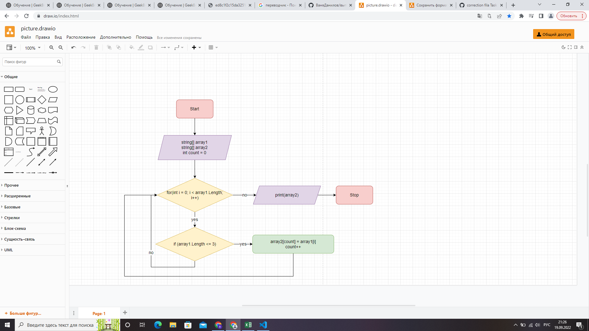

# Задача:

*Написать программу, которая из имеющегося массива строк формирует массив из строк, длина которых меньше либо равна 3 символа. Первоначальный массив можно ввести с клавиатуры, либо задать на старте выполнения алгоритма. При решение не рекомендуется пользоваться коллекциями, лучше обойтись исключительно массивами.*

# Решение:

*Jбъявляется два массива, одинаковый длины. Затем метод, в котором цикл соразмерный длине массива, внутри цикла проверка условия ( <=3 ), если да элемент первого массива заносится в count второго массива. Переменная count поочередно закидывает значения из первого массива во второй. После присвоения увеличивается переменная count на 1(count++) и возвращается к циклу for в котором i увеличивается на 1(i++). И так пока условие не выполниться.*

# Схема:

